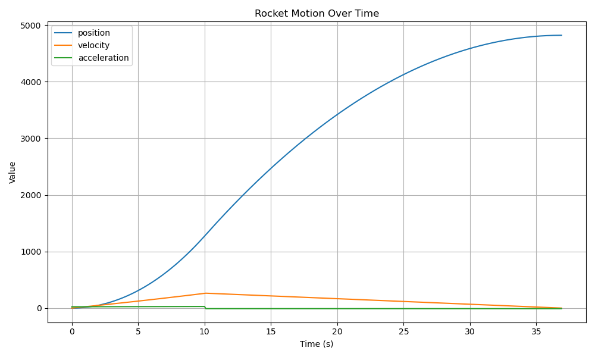
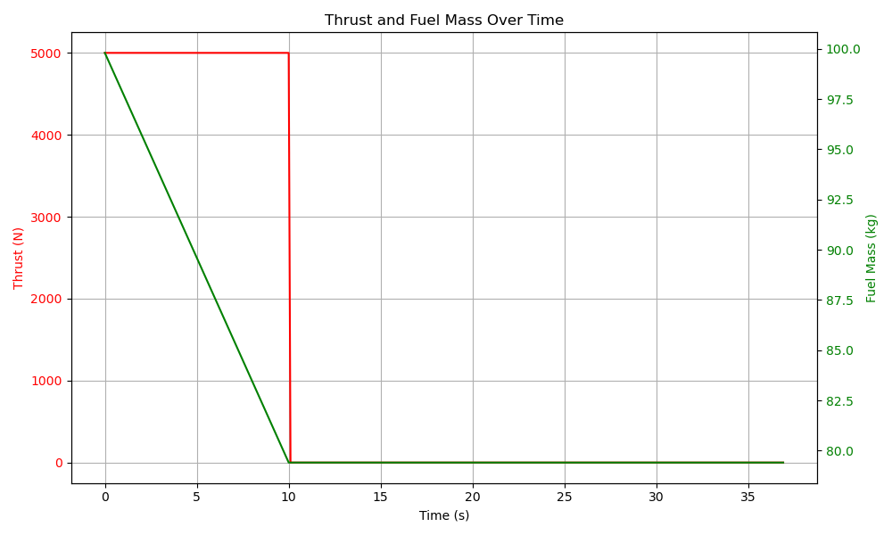

# RocketLaunch

A simple C++ rocket trajectory simulator that models vertical launches with physics-based integration. This simulator supports:

- Thrust, fuel burn, mass flow  
- Acceleration, g-load, velocity, and altitude tracking  
- Engineering metrics (impulse, acceleration limits, efficiency)  
- CSV logging + Matplotlib visualization  

---

## Sample Output

```
--- Engineering Analysis --------------------------------
Vehicle mass ratio                : 1
Propulsion-unit mass ratio        : 1
Propellant mass fraction (ζ)      : 2.5
Effective exhaust velocity (c)    : 2452.5 m/s
Mass-flow rate (ṁ)                : 2.03874 kg/s
Thrust                            : 5000 N
Total impulse (I_t)               : 50000 N·s
Impulse-to-weight ratio           : 127.421 s
Max acceleration                  : 33.3333 m/s²  (3.39789 g)
----------------------------------------------------------
```

### Rocket Motion



### Thrust and Fuel Mass



---

## Running

1. **Compile the simulator:**
   ```bash
   g++ -std=c++17 *.cpp -o RocketLaunch
   ```

2. **Run the simulation:**
   ```bash
   ./RocketLaunch
   ```

3. **Generate plots (requires pandas and matplotlib):**
   ```bash
   python3 visualizer.py
   ```

This will generate `output.csv`, which contains timestep data, and create the plots `motion_plot.png` and `thrust_fuel_plot.png`.

---

## Files

| File                  | Description                                      |
|-----------------------|--------------------------------------------------|
| `main.cpp`            | Entry point and rocket configuration             |
| `RocketStage.hpp`     | Defines thrust, burn time, fuel and dry mass     |
| `RocketSimulator.*`   | Core physics simulation and state integration    |
| `RocketState.*`       | Struct to hold and format simulation state       |
| `EngineeringReport.*` | Computes engineering metrics (impulse, g-load)   |
| `visualizer.py`       | Generates matplotlib plots from output CSV       |

---

## Dependencies

- C++17 or later  
- Python 3.x with:
  - `pandas`
  - `matplotlib`

Install Python dependencies with:

```bash
pip install pandas matplotlib
```

---

## Future Improvements

- Multistage rocket support  
- Atmospheric drag modeling  
- Launch angle / off-vertical trajectory simulation  
- Thrust curve input from file  
